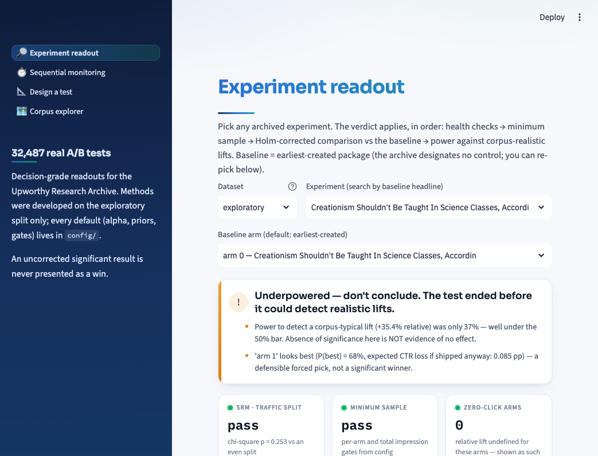
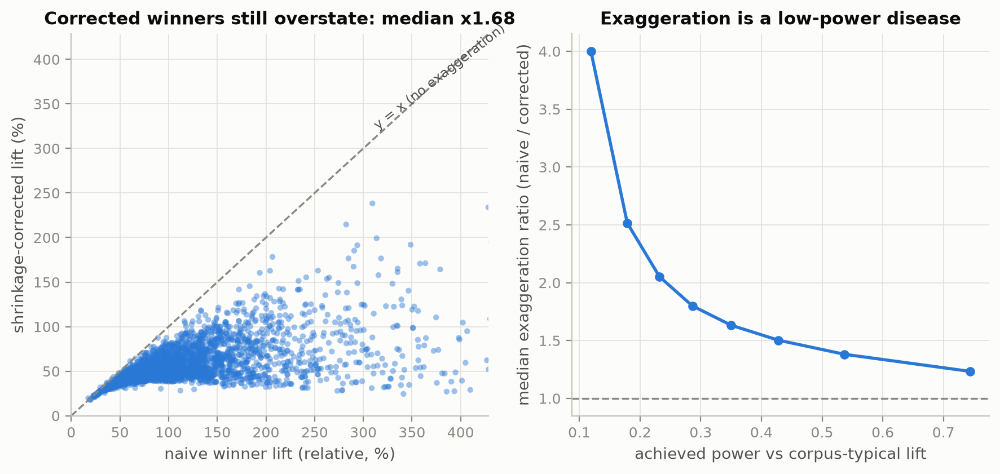

# 🧪 Upworthy Readout: An Experiment Readout Engine and Decision Dashboard for 32,487 Real A/B Tests

Every headline/image A/B test Upworthy.com ran between January 2013 and April 2015 - 32,487 experiments, 150,817 arms, ~538 million participant assignments ([Upworthy Research Archive](https://upworthy.natematias.com/about-the-archive.html), [Nature Scientific Data](https://www.nature.com/articles/s41597-021-00934-7)) - re-analyzed with the statistics an experimentation platform should have applied.
We built a reusable statistics library, a batch analysis pipeline, and a dashboard that renders a decision-grade readout for any of those experiments.

A readout must get five things right: health checks before inference (a broken traffic split invalidates a test, it doesn't decide it); corrections for testing many arms and many experiments; the winner's curse (the arm you noticed *because it won* is exaggerated by selection); power against effects that actually occur, so "not significant" is never silently read as "no effect"; and anytime-valid methods if anyone will peek before the end.
This repo demonstrates all five, on real data, at scale.

<p align="center"></p>

---

### Headline Findings

We analyzed 27,612 tests (22,741 confirmatory + 4,871 holdout; 2 single-arm tests dropped) exactly once, with methods frozen from the exploratory set:

1. **Winner's curse is huge.**
   The median winning arm claims **+96%** relative CTR lift; the shrinkage-corrected estimate is **+50%** - a median exaggeration of **×1.69**.
   Selection bias grows as power falls (see figure).
2. **Most "wins" evaporate under honest accounting.**
   5,009 tests have an uncorrected significant winner; 3,197 survive within-test Holm; 1,554 survive corpus-level BH.
   That is **69% of naive wins gone**.
3. **The corpus was underpowered for its own effect sizes.**
   Median power to detect a corpus-typical lift (+35% relative) was **32%**, and only **3.5%** of tests reached the 80% planning bar.
   Verdicts: 55.8% "underpowered - don't conclude", 17.1% keep baseline, 11.6% ship a variant.
4. **Peeking would have wrecked it.**
   Stop-at-first-p<0.05 hits a 22-27% false-positive rate at 20-50 looks on null streams, while mSPRT stays ≤0.5% monitored continuously.
   Replaying real no-winner tests, naive peeking shows a phantom mid-test "win" in **38%** of them.
5. **15.4% of tests fail SRM** (traffic split inconsistent with uniform randomization at p<0.001, ~150× the nominal rate).
   All 4,259 of them are excluded from every count above.
6. **Upworthy's own declared winners rarely survive.**
   Of 6,502 tests where their tooling declared a winner, only **19.9%** are confirmed by the corrected analysis; 51% were declared from underpowered tests.

Every one of these replicated out-of-sample: exploratory, confirmatory, and holdout give exaggeration ×1.65 / ×1.69 / ×1.73, evaporation 70% / 69% / 68%, median power 32% in all three, and SRM 15.5% / 15.5% / 15.0%.
Per-set numbers live in `outputs/results/{set}_summary.json`.

<p align="center"></p>

The exploratory/confirmatory discipline is itself part of the demonstration: the archive ships pre-split, and **every method, threshold, prior, and default here was developed on the exploratory set only** (4,873 tests).
The confirmatory + holdout sets (27,614 tests) were analyzed exactly once, with methods frozen, to produce the numbers above.
No result from those sets fed back into any choice.

---

### Technology Stack

We have used a combination of the following technologies:

1. **Python 3.11+** - the core language for the statistics library, the pipeline, and the dashboard.
2. **NumPy + SciPy** - vectorized Monte Carlo, distributions, optimization, and quadrature behind every statistical routine.
3. **Pandas + PyArrow** - data manipulation in the analysis layer and compact Parquet results the dashboard reads.
4. **Streamlit** - the four-page, read-only decision dashboard.
5. **Plotly** - interactive charts inside the dashboard.
6. **Matplotlib** - the static meta-analysis figures in `outputs/figures/`.
7. **uv** - fast, lockfile-driven environment management, used identically in development, CI, and Docker.
8. **pytest + statsmodels** - the simulation-validation test suite; statsmodels appears only as a reference implementation to validate against.

We have kept **abkit**, the statistics core, free of pandas and I/O because pure functions on counts are trivially testable by simulation and reusable outside this project.

---

### The Three Components

1. **`abkit` - a reusable experimentation library (`src/abkit/`).**
   Pure typed functions on counts: design (power / MDE / sample size), frequentist readout (two-proportion z, Wilson & Newcombe & Katz intervals, k-arm chi-square), sequential inference (mSPRT always-valid p-values and confidence sequences, Monte-Carlo-calibrated O'Brien-Fleming boundaries for contrast), multiplicity (Holm within a test, Benjamini-Hochberg across a corpus), empirical-Bayes shrinkage with winner's-curse estimators, Beta-Binomial Bayesian readout (P(best), expected loss), and health checks (SRM, minimum-sample gates) - composed into one verdict by `abkit.readout`.
   **Every statistical routine is validated in `tests/` against simulation or a reference implementation**: empirical type-I error ≈ α, CI coverage ≈ nominal, shrinkage posterior calibration, mSPRT error control under *continuous* monitoring (while the naive repeated z-test demonstrably inflates), and O'Brien-Fleming constants recovered against published values.
2. **Corpus meta-analysis (`src/analysis/`).**
   Checksummed OSF ingest, count validation against the published totals, corpus priors fit on the exploratory set (frozen thereafter), batch readouts, then the figures in `outputs/figures/` and the numbers above.
3. **Decision dashboard (`src/dashboard/`, Streamlit).**
   A readout tool, not a chart gallery.
   Four screens: **experiment readout** (verdict, naive *vs* corrected lift with intervals, Bayesian panel, health badges, achieved power - every number with a plain-English line a non-statistician can act on), **sequential monitoring** (replay a test with a narrowing confidence sequence, a "could have safely stopped here" marker, and the naive peeking rejections it avoids), **design-a-test** (power/MDE anchored to the corpus prior: *plan for lifts that actually occur*), and the **corpus explorer**.
   Read-only over precomputed parquet; an uncorrected significant result is never presented as a win anywhere in the UI.

---

### Set Up

#### 1 Environment Setup

1. Clone the repository:
   ```bash
   git clone https://github.com/<yourusername>/upworthy-readout.git
   cd upworthy-readout
   ```

2. Install the environment (uv, Python 3.11+):
   `make setup`

#### 2 Data Setup

Precomputed batch results are committed, so the dashboard works immediately after cloning - no downloads needed:
   `make dashboard`

For a full reproduction, download the archive from OSF (checksummed, cached, ~95 MB):
   `make data`

#### 3 Running the Pipeline

1. Fit the corpus priors (exploratory set only, frozen thereafter):
   `make priors`

2. Batch readouts + meta-analysis figures on the exploratory set:
   `make analysis`

3. Run the test suite (82 tests, including the simulation-validation suite):
   `make test`

4. The one-shot final run on confirmatory + holdout (intentionally run once):
   `make confirmatory`

5. Launch the Streamlit dashboard:
   `make dashboard`

Docker alternative: `docker build -t upworthy-readout . && docker run -p 8501:8501 upworthy-readout`.
CI runs lint (ruff), types (mypy strict), the full test suite, and an end-to-end pipeline smoke run on a committed 50-test sample - it never downloads the archive.

---

### Methods Appendix

- **Baseline convention.**
  The archive designates no control arm; the earliest-created package is treated as the incumbent baseline (stated in the UI, re-pickable in the dashboard).
  Only 2.6% of tests are 2-arm; the modal test has 4 arms, so k-arm corrections are the norm, not an edge case.
- **Intervals.**
  Wilson per arm; Newcombe hybrid for absolute lift; Katz log-scale for relative lift.
  At 1.5% CTR, Wald intervals are unreliable and are not used.
  Zero-click arms are legal inputs: the relative lift is reported as *undefined* there, never as a number.
- **Shrinkage.**
  theta = log-odds lift vs baseline; theta_hat ~ N(theta, se²) with Woolf variance; theta ~ N(mu, tau²) fit by marginal MLE on exploratory (mu = -0.064: later-created variants run slightly worse than the incumbent on average; tau = 0.303: a one-sd true lift is ~35% relative - headline effects at Upworthy were large and heterogeneous).
  Time-split calibration (fit early weeks, score late weeks) gives z-dispersion 1.06 ≈ 1.
  Posterior means are the "corrected" lifts everywhere.
  Odds-ratio ≈ risk-ratio at these CTRs (documented approximation).
- **Sequential.**
  mSPRT with a normal mixture on the absolute lift; mixture variance phi = 2.5e-5 ≈ E[theta²] under the corpus prior (validity holds for any phi; only power depends on it).
  Confidence sequences come from the same martingale.
  No event-level data exists, so dashboard replays are **conditional permutation replays** - exact given the final counts, labeled as reconstructions.
  Corpus peeking-damage numbers come from simulated streams with known truth.
- **Multiplicity.**
  Holm across a test's pairwise-vs-baseline comparisons (family-wise control for "ship X"); BH at q=0.05 across the corpus on the per-test Holm-corrected p (FDR control for "how many wins are there").
- **SRM.**
  Chi-square against uniform allocation at α=1e-3.
  A large share of archive tests fail (15.5% exploratory).
  We checked the obvious mechanism - arms added mid-test - and it does *not* explain the failures (failing tests have *smaller* arm-creation spreads).
  The cause is not recoverable from aggregate data; flagged tests are excluded from all win counts, which is the correct platform behavior regardless of mechanism.
- **Power.**
  "Achieved power" is against a one-prior-sd true lift - the size of effect this corpus actually produces - not an arbitrary MDE.
- **Every default** (α=0.05, SRM α=1e-3, gates, phi, MC draws, seeds) lives in `config/defaults.yaml`; the fitted priors live in `config/fitted_priors.yaml` with provenance.

---

### Limitations

- **One metric.**
  Clicks/impressions only.
  No downstream engagement, no guardrails; a real decision would weigh more than CTR.
- **2013-15 media context.**
  Upworthy-era curiosity-gap headlines; effect sizes and feature findings should not be extrapolated to other products or eras.
- **No user-level data.**
  Aggregates per arm only: no CUPED (nothing to covary on), no interference or novelty-effect checks, and sequential replays are reconstructions, not logs.
- **SRM mechanism unknown.**
  We can flag and exclude, but not diagnose, the allocation anomalies.
- **External validity.**
  One company, one surface, one outcome.
  The *methods* transfer; the *numbers* describe this corpus.

---

### Future Work

Extensions this archive cannot support (mostly for lack of user-level data), but that follow naturally from the methods here:

- **Guardrail metrics with non-inferiority gates** - a CTR win that hurts retention or revenue is a loss; verdicts should require "primary wins AND guardrails don't regress (one-sided non-inferiority)".
- **CUPED / regression adjustment** on user-level pre-exposure covariates - the standard 30-50% variance reduction (Deng et al., 2013) this archive can't demonstrate for lack of user data.
- **Automated SRM triage**, not just detection: segment-level chi-squares (browser, geo, day) to localize the broken slice, and quarantine rules.
- **Interference & novelty checks** - switchback or cluster designs where units interact; first-week vs later-week effect comparison before shipping.
- **Corpus-level holdouts** - a standing 5% global holdout to measure the *cumulative* effect of shipped wins against the shrinkage predictions (the winner's-curse ledger, closed).
- **Decision memos as artifacts** - the dashboard's verdict block, persisted and versioned per experiment, so "why did we ship this" has an answer a year later.

---

### References

#### Dataset

- [The Upworthy Research Archive, a time series of 32,487 experiments in U.S. media](https://doi.org/10.1038/s41597-021-00934-7) (Matias et al., *Scientific Data*, 2021) - the dataset itself, distributed for research via [OSF](https://osf.io/jd64p/) courtesy of Good Inc. and the archive team.

#### Statistical methodology

- [Interval estimation for the difference between independent proportions: comparison of eleven methods](https://doi.org/10.1002/(SICI)1097-0258(19980430)17:8%3C873::AID-SIM779%3E3.0.CO;2-I) (Newcombe, 1998) - the hybrid score interval behind every absolute-lift CI in `abkit.freq`.
- [Peeking at A/B tests: why it matters, and what to do about it](https://doi.org/10.1145/3097983.3097992) (Johari et al., KDD 2017) - the mSPRT always-valid p-values implemented in `abkit.sequential`.
- [Always valid inference: continuous monitoring of A/B tests](https://doi.org/10.1287/opre.2021.2135) (Johari et al., *Operations Research*, 2022) - the confidence sequences shown on the sequential-monitoring page.
- [Beyond power calculations: assessing Type S (sign) and Type M (magnitude) errors](https://doi.org/10.1177/1745691614551642) (Gelman & Carlin, 2014) - the exaggeration-factor framing behind `expected_winner_exaggeration` in `abkit.shrinkage`.
- [The significance filter, the winner's curse and the need to shrink](https://doi.org/10.1111/stan.12241) (van Zwet & Cator, 2021) - why selected estimates must be shrunk; the rationale for reporting shrinkage-corrected lifts everywhere.

#### Industry practice

- [Trustworthy Online Controlled Experiments: A Practical Guide to A/B Testing](https://doi.org/10.1017/9781108653985) (Kohavi, Tang & Xu, 2020) - the platform-practice reference for SRM as an invalidation gate, multiplicity conventions, and guardrails.
- [Diagnosing sample ratio mismatch in online controlled experiments](https://doi.org/10.1145/3292500.3330722) (Fabijan et al., KDD 2019) - the SRM taxonomy and strict-alpha convention used by `abkit.health`.
- [Winner's curse: bias estimation for total effects of features in online controlled experiments](https://doi.org/10.1145/3219819.3219905) (Lee & Shen, KDD 2018) - the winner's curse measured inside an industry platform; the industrial counterpart of this project's central finding.
- [Improving the sensitivity of online controlled experiments by utilizing pre-experiment data (CUPED)](https://doi.org/10.1145/2433396.2433413) (Deng et al., WSDM 2013) - the variance-reduction technique listed under Future Work; it needs the user-level data this archive lacks.
- [Bayesian A/B Testing at VWO](https://vwo.com/downloads/VWO_SmartStats_technical_whitepaper.pdf) (Stucchio, 2015) - the expected-loss decision rule used in the Bayesian panel of the readout page.

---

```
root/
├── .github/workflows/ci.yml          # CI: lint, types, tests, sample smoke run
├── .streamlit/config.toml            # Dashboard theme
├── config/
│   ├── defaults.yaml                 # Every statistical default, documented
│   └── fitted_priors.yaml            # Frozen corpus priors (exploratory fit only)
├── data/
│   ├── raw/                          # Checksummed OSF downloads (not tracked)
│   ├── processed/                    # Normalized parquet per split (not tracked)
│   └── sample/sample_50_tests.csv    # Committed 50-test sample for CI
├── notebooks/
│   └── upworthy_readouts.ipynb       # Narrative results walkthrough
├── outputs/
│   ├── figures/                      # Meta-analysis figures per split
│   └── results/                      # Committed batch readouts (parquet/JSON)
├── src/
│   ├── abkit/                        # The statistics library (typed, tested, importable alone)
│   ├── analysis/                     # Ingest -> priors -> batch readouts -> meta-analysis
│   └── dashboard/                    # Streamlit app (4 pages, read-only)
├── tests/                            # 82 tests; the simulation-validation suite
├── Dockerfile                        # Dashboard container (results baked in)
├── Makefile                          # Every artifact regenerable from here
├── pyproject.toml                    # Dependencies and tool configuration
└── README.md
```
